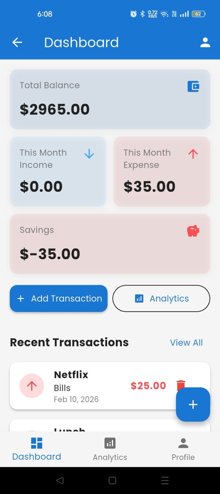
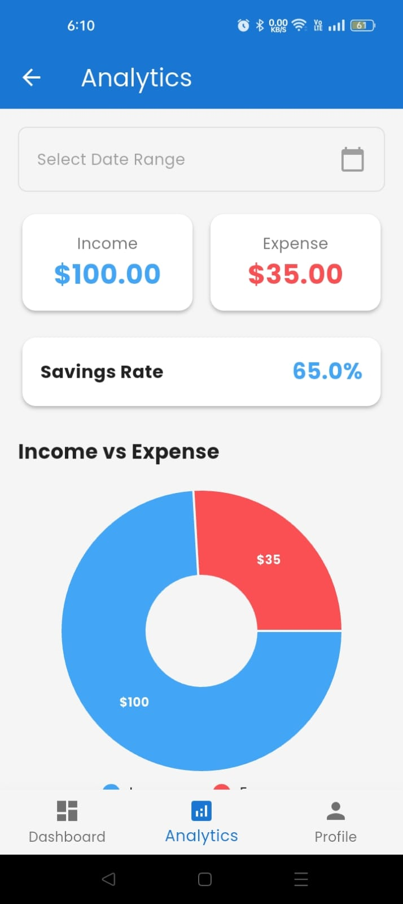
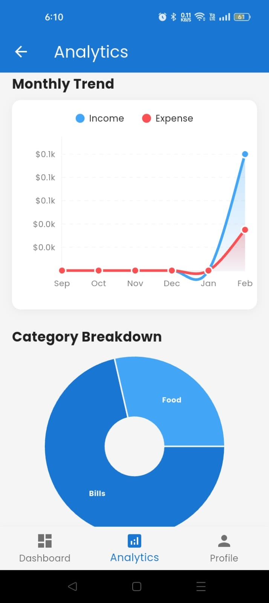
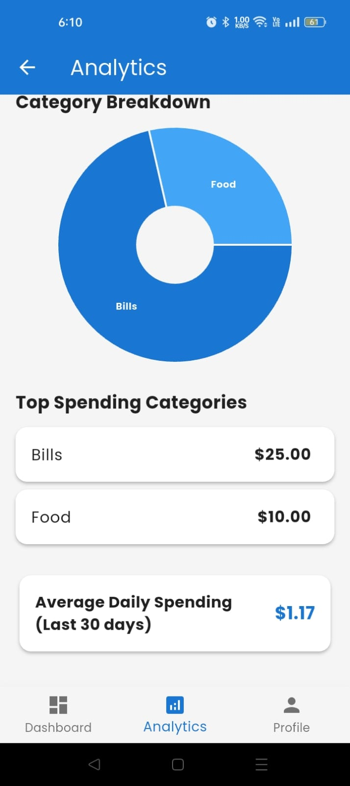
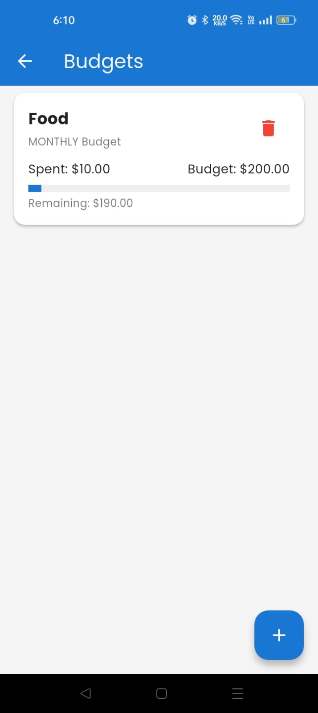
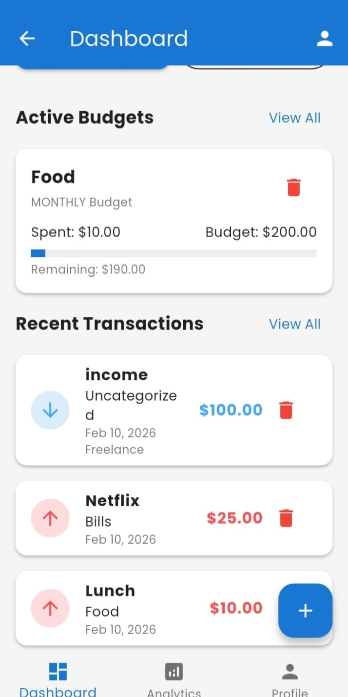
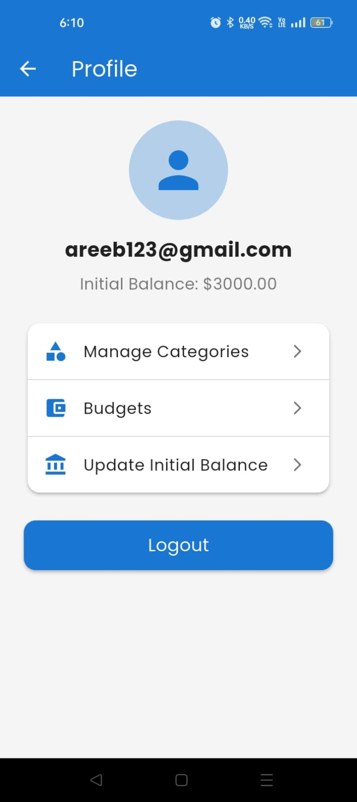

# Flutter-Finance Tracker App

A mobile-first finance tracking application built using Flutter and Firebase to help users manage expenses and income efficiently.

## Features
- Add and track income & expenses
- Add tracsactions and manage Budgets
- Monthy or weekly analytics
- Real-time Firebase database
- Clean and intuitive UI
- Secure data storage

## Tech Stack
- Flutter
- Firebase
- RESTful APIs

## Screenshots
## Screenshots

### Onboarding & Authentication

### Dashboard & Analytics

### Budget & Transactions

### User Profile

### Welcome Screen

## Purpose
Built as a real-world project to practice Flutter app development and backend integration.

## Author
Andleeb Razzaq

